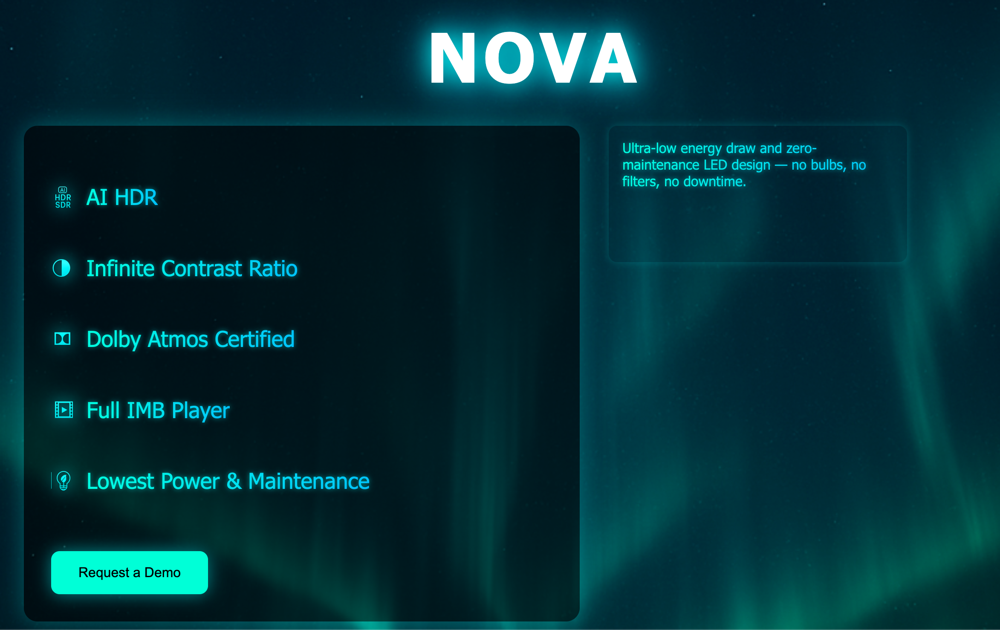

# NOVA™ LED Display Landing Page



A cinematic-themed interactive landing page for **NOVA**, the next-generation LED display platform for theaters.

This site highlights NOVA’s key features with glowing icons, responsive layout, and a clean user flow for lead capture. Built using pure HTML, CSS, and JavaScript — no frameworks required.

---

## ✨ Features

- ⚡ **AI HDR to SDR conversion**
- 🌌 **Infinite contrast LED technology**
- 🔊 **Dolby Atmos certified**
- 🎞 **Built-in IMB player**
- 🌱 **Low energy, zero-maintenance**
- 💬 Interactive feature descriptions on click
- 📧 Lead form with ESC + outside-click dismiss

---


---

## 🚀 Live Demo

Coming soon at:  
**https://yourdomain.com/nova**  
Or run locally:

```bash
# clone the repo
git clone https://github.com/yourusername/nova-landing.git

# open index.html in your browser
